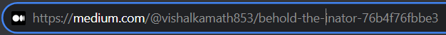

# Self Healing URLs

Self-healing URLs refer to an approach where URLs are designed to adapt or correct themselves when broken or when the linked content changes. These URLs are created dynamically to redirect users to the correct content even if the initial link is outdated or invalid.

For instance, a self-healing URL might include a unique identifier or metadata that allows it to recognize when the content it points to has changed or moved. When someone accesses this URL, the system behind it checks the identifier or metadata to determine the current location or version of the content and redirects the user accordingly.

### Try it out now!!

Medium uses Self-healing URLs, try changing the slug without tampering with the index number at the end

Hit enter and BANG!!🎉, you get redirected to the original URL.

This approach is especially useful for maintaining links in dynamic environments like content management systems, where content is frequently updated, moved, or deleted. Self-healing URLs help ensure a smoother user experience by minimizing the impact of broken links and providing users with access to the intended content even when URLs change over time.

### How do they help with SEO

1. **Broken Link Prevention:** Self-healing URLs reduce broken links, ensuring a seamless user experience. This decreases the chance of users encountering dead ends, which can negatively impact SEO rankings.
2. **Consistent Indexing:** By maintaining functional URLs even through content updates or changes, self-healing URLs help search engines consistently index website content. This ensures that the latest and relevant information is available to users and search engines.
3. **Enhanced User Experience:** Seamless navigation due to self-healing URLs improves user satisfaction. Positive user behavior metrics like reduced bounce rates and increased time on site contribute positively to SEO.
